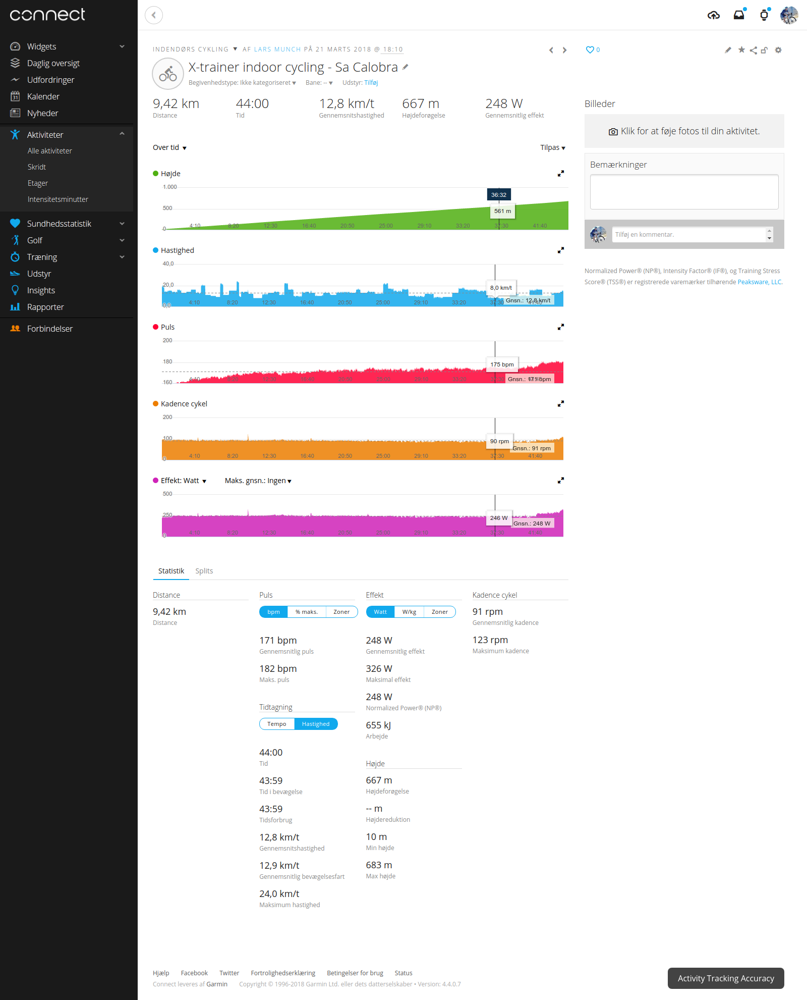

# X-trainer Convert

Convert indoor bike workout data from X-trainer format to TCX.

X-trainer studio in Bagsværd, Denmark http://www.x-trainer-studio.dk/ uses the
X-Trainer bike computer on the Body Bikes for logging workout data. Workout
data is logged to the athletes SD card in a simple CSV format. This tool can
convert the logged data into TCX format which can be uploaded to Strava,
Garmin, Endomondo and more.

Note: When the time is stopped during rest periods in between intervals
nothing is logged. To compensate for for this dummy rest data is inserted. The
dummy rest data is 130BPM, 15KM/t, 100W and 70RPM. The heart rate is assumed
to drop 20 beats per minute while resting until reaching 130. This can cause a
slightly different training impulse score than the actual one.

# Usage

```
usage: x-trainer-convert.py [-h] [-v] [--upload] [-u USERNAME] [-p PASSWORD]
                            FILE [FILE ...]

X-trainer convert

positional arguments:
  FILE                  CSV files to convert

optional arguments:
  -h, --help            show this help message and exit
  -v, --verbose         verbose output (default: False)
  --upload              upload to Garmin Connect (default: False)
  -u USERNAME, --username USERNAME
                        Garmin Connect user login (default: None)
  -p PASSWORD, --password PASSWORD
                        Garmin Connect user password (default: None)

Convert indoor bike workout data from X-trainer CSV format to TCX
```

# Example



# Release

There is no official release yet. Please see the [ChangeLog](CHANGELOG.md) for
details.

# TODO

 * Windows support (might actually already work)
 * Real Python pip packaging and actual 1.0 release
 * Unit tests
 * OAuth support (nice to have)
